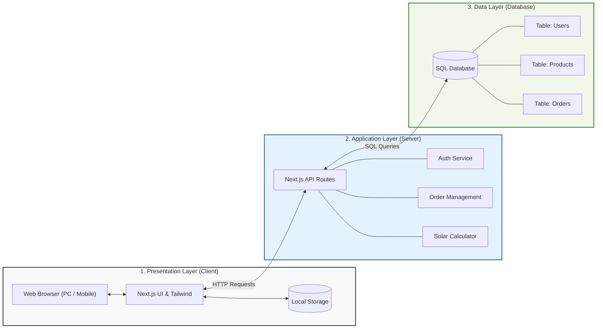

# Project-CSI204: SolarCell e-Commerce Platform
> แพลตฟอร์มพาณิชย์อิเล็กทรอนิกส์สำหรับจำหน่ายแผงโซลาเซลล์และอุปกรณ์พลังงานแสงอาทิตย์ครบวงจร (SolarTech)

ยินดีต้อนรับสู่โปรเจกต์ **SolarCell e-Commerce Platform** แพลตฟอร์มพาณิชย์อิเล็กทรอนิกส์ในรูปแบบ Web Application ที่ตอบโจทย์การใช้งานทั้งรูปแบบธุรกิจกับผู้บริโภค (B2C) และธุรกิจกับธุรกิจ (B2B) สำหรับผู้ที่ต้องการจัดซื้อแผงโซลาเซลล์ และผู้ดูแลระบบในการบริหารจัดการสินค้าพลังงานแสงอาทิตย์อย่างมีประสิทธิภาพครบวงจร

---

## 👥 สมาชิกในทีม (Team Members)

* **นายยศกร อำนวยผล** (67083987)
* **นายธนพงศ์ เกิดสิริ** (67087918)
* **นายภูไพศาล อุดมเพรชไพศาล** (67088026)
* **นายกวิน สุพจยันทบูลย์** (67091861)
* **นายชนะพล เสรีคุณาคุณ** (67127924)

---

## 2. หลักการและเหตุผล (Introduction & Rationale)

ในปัจจุบัน ปัญหาการเปลี่ยนแปลงสภาพภูมิอากาศ (Climate Change) และภาวะโลกร้อนส่งผลกระทบอย่างรุนแรงทั่วโลก ทำให้หลายประเทศรวมถึงประเทศไทยหันมาให้ความสำคัญกับการใช้พลังงานสะอาด (Renewable Energy) มากยิ่งขึ้น ประกอบกับวิกฤตราคาพลังงานที่ปรับตัวสูงขึ้นอย่างต่อเนื่อง ส่งผลให้ค่าไฟฟ้าภาคครัวเรือนและภาคธุรกิจมีอัตราที่สูงขึ้นตามไปด้วย ด้วยเหตุนี้ ประชาชนและผู้ประกอบการจำนวนมากจึงมีความต้องการติดตั้งระบบผลิตไฟฟ้าพลังงานแสงอาทิตย์บนหลังคา (Solar Roof) เพื่อลดภาระค่าใช้จ่ายและสร้างความยั่งยืนด้านพลังงาน

แม้ความต้องการในตลาดจะสูงขึ้น แต่การเข้าถึงและเลือกซื้ออุปกรณ์โซล่าเซลล์สำหรับบุคคลทั่วไป ยังคงมีความซับซ้อน ผู้บริโภคส่วนใหญ่ขาดความรู้ความเข้าใจด้านวิศวกรรม ไม่ทราบว่าควรเลือกขนาดกำลังการผลิต เท่าใดจึงจะคุ้มค่าและเหมาะสมกับพฤติกรรมการใช้ไฟฟ้าของตนเอง ในขณะเดียวกัน ฝั่งผู้รับเหมาหรือลูกค้าองค์กร ที่ต้องการสั่งซื้ออุปกรณ์จำนวนมาก ก็ยังเผชิญปัญหาความล่าช้าในการขอใบเสนอราคา การตรวจสอบสต็อกสินค้า และขาดแพลตฟอร์มส่วนกลางที่อำนวยความสะดวกในการสั่งซื้ออย่างเป็นระบบ

จากปัญหาดังกล่าว โครงการนี้จึงได้มีแนวคิดในการพัฒนาโครงงาน "SolarTech: แพลตฟอร์มพาณิชย์อิเล็กทรอนิกส์สำหรับจัดจำหน่ายอุปกรณ์โซล่าเซลล์แบบครบวงจร (B2B & B2C)" ขึ้นมา โดยตัวระบบจะทำหน้าที่เป็นตัวกลางในการจัดจำหน่ายแผงโซล่าเซลล์ อินเวอร์เตอร์ และอุปกรณ์ที่เกี่ยวข้อง พร้อมฟีเจอร์เด่นคือ "ระบบคำนวณขนาดติดตั้งอัตโนมัติ (Solar Calculator)" ที่ช่วยประเมินความคุ้มค่าเบื้องต้นให้แก่ลูกค้าทั่วไป และ "ระบบตะกร้าสินค้าพร้อมขอใบเสนอราคา" เพื่อรองรับกลุ่มลูกค้าผู้รับเหมา โครงงานนี้ไม่เพียงแต่ช่วยเพิ่มประสิทธิภาพในการบริหารจัดการธุรกิจ (E-Commerce) แต่ยังช่วยส่งเสริมให้คนไทยเข้าถึงพลังงานสะอาดได้ง่ายและแม่นยำยิ่งขึ้น

---

## 3. วัตถุประสงค์ (Objectives)

1. เพื่อออกแบบและพัฒนาแพลตฟอร์มพาณิชย์อิเล็กทรอนิกส์ (E-Commerce) สำหรับจัดจำหน่ายแผงโซล่าเซลล์และอุปกรณ์ที่เกี่ยวข้อง ที่รองรับรูปแบบการสั่งซื้อทั้งสำหรับลูกค้าทั่วไป
2. เพื่อพัฒนาระบบคำนวณขนาดติดตั้งโซล่าเซลล์เบื้องต้น (Solar Calculator) ที่สามารถประเมินความคุ้มค่าและแนะนำขนาดกำลังการผลิต (kW) ที่เหมาะสมกับพฤติกรรมการใช้ไฟฟ้าของผู้ใช้งานได้อย่างแม่นยำ
3. เพื่อสร้างระบบการจัดการตะกร้าสินค้าและคำสั่งซื้อ (Order Management System) ที่ช่วยให้ผู้ใช้งานสามารถทำรายการสั่งซื้อได้อย่างสะดวกรวดเร็ว และสามารถบันทึกข้อมูลคำสั่งซื้อได้อย่างเป็นระบบ
4. เพื่อประยุกต์ใช้เทคโนโลยีการพัฒนาเว็บแอปพลิเคชันสมัยใหม่ (Modern Web Development) ในการสร้างส่วนติดต่อผู้ใช้งาน (User Interface) ที่มีความสวยงาม ทันสมัย และตอบสนองการทำงานได้อย่างรวดเร็ว (เสถียรภาพสูง)

---

## 4. ขอบเขตของระบบและบทบาทผู้ใช้งาน (Service Scope & User Roles)

ระบบแบ่งกลุ่มผู้ใช้งานออกเป็น 2 ระดับ ได้แก่:

### 4.1 ลูกค้า (Customer)
* ผู้ใช้งานทั่วไปสามารถค้นหาและกรองสินค้าตามที่ต้องการได้
* การสั่งซื้อสินค้าสามารถดูรายละเอียดสินค้าได้ และทำการสั่งซื้อได้
* สามารถติดตามสถานะการสั่งซื้อได้

### 4.2 พนักงาน (Staff)
* พนักงานมีหน้าที่จัดการสินค้าคงคลัง ตรวจสอบคำสั่งซื้อ และดูข้อมูลสรุปยอดขาย

### 4.3 แอดมิน (Admin)
* **หน้าที่หลัก:** การจัดการภาพรวมธุรกิจ (Management)
* มีสิทธิ์การปฏิบัติงานทุกอย่างครอบคลุมของพนักงาน
* **สิทธิ์พิเศษขั้นสูง:** จัดการบัญชีผู้ใช้งาน (เช่น กำหนดสิทธิ์ให้คนนี้เป็นพนักงาน), ดูหน้า Dashboard สรุปยอดขายรายเดือน/รายปี และดูรายงานสถิติเชิงลึก

---

## 5. แนวทางการพัฒนาตาม SDLC (System Development Life Cycle)

* **Phase 1: Planning (การวางแผน):** กำหนดขอบเขตของระบบ SolarTech, จัดทำแผนการดำเนินงาน, วางโครงสร้างโปรเจกต์บน GitHub Repository สำหรับทำงานร่วมกัน, กำหนด System Architecture, และแบ่งหน้าที่ความรับผิดชอบของสมาชิกภายในทีมอย่างชัดเจน
* **Phase 2: Analysis (การวิเคราะห์):** รวบรวมและวิเคราะห์ Requirement ของผู้ใช้งานทั้ง 3 ระดับ (ลูกค้า, พนักงาน, ผู้ดูแลระบบ), จัดทำ User Personas, และใช้ Use Case Diagram ในการวิเคราะห์พฤเทิกรรมตั้งแต่การใช้เครื่องมือประเมินขนาดติดตั้ง (Solar Calculator) ไปจนถึงขั้นตอนการสั่งซื้อ
* **Phase 3: Design (การออกแบบ):** ออกแบบ Wireframe และ UI/UX สำหรับ Frontend ให้ดูมีความน่าเชื่อถือ (สไตล์ Corporate Platform โทนสีน้ำเงิน-ขาว), เขียน ER Diagram เพื่อกำหนดความสัมพันธ์ของตารางฐานข้อมูล (เช่น Users, Products, Orders), รวมไปถึงการทำ API Specification
* **Phase 4: Development (การพัฒนาระบบ):** ลงมือเขียนโค้ดตามที่ออกแบบไว้ โดยพัฒนา Backend ด้วย Node.js, พัฒนา Frontend ด้วย React และ Next.js, และใช้ระบบฐานข้อมูลแบบ SQL พร้อมทั้งเชื่อมต่อระบบจัดการตะกร้าสินค้าเข้าด้วยกันทั้งหมด
* **Phase 5: Testing (การทดสอบ):** ทดสอบการเรียก API, ตรวจสอบการทำงานของสูตรคำนวณและฟอร์มบนหน้าเว็บจริง, และการจำลองเป็นผู้ใช้งานเพื่อเดินตามโฟลว์ตั้งแต่กดหยิบสินค้าจนถึงการชำระเงิน (UAT) เพื่อตรวจสอบตรรกะและหาข้อผิดพลาด
* **Phase 6: Deployment (การติดตั้งระบบ):** นำระบบที่ผ่านการทดสอบสมบูรณ์แล้วไปอัปโหลดและติดตั้งบน Cloud เพื่อให้ผู้ใช้งานสามารถเข้าถึงแพลตฟอร์มได้จากอินเทอร์เน็ต
* **Phase 7: Maintenance (การบำรุงรักษา):** รวบรวม Feedback จากผู้ใช้งานจริงเพื่อนำมาวิเคราะห์ แก้ไขบั๊ก (อาทิ การตรวจสอบความถูกต้องจากไฟล์ Log JSON) และปรับปรุงจุดที่ใช้งานไม่สะดวก

---

## 6. ข้อตกลงระดับการให้บริการ (Service Level Agreement - SLA)

เพื่อประสิทธิภาพสูงสุดและความพร้อมในการใช้งาน แพลตฟอร์มได้กำหนดมาตรฐานตัวชี้วัดไว้ดังนี้:

* **ความพร้อมใช้งานของระบบ (Availability):** ระบบต้องมีความพร้อมใช้งานต่อเนื่องไม่น้อยกว่า **99.5% ต่อเดือน** (รวมเวลาปิดปรับปรุงระบบล่วงหน้า / Maintenance Window)
* **ระยะเวลาการตอบสนอง (Response Time):** ระบบต้องตอบสนองต่อคำขอ (Request) **ภายใน 3 วินาที** (เช่น การประมวลผลคำค้นหาแผงโซล่าเซลล์และแสดงผลลัพธ์)
* **การสำรองข้อมูล (Backup Plan):** ทำการสำรองข้อมูลคำสั่งซื้อ ประวัติการชำระเงิน และข้อมูลลูกค้า **ทุกวัน (Daily Backup) ณ เวลา 02:00 น.** โดยจัดเก็บข้อมูลสำรองย้อนหลังเป็นเวลา 30 วัน
* **ความปลอดภัยของข้อมูล (Data Security):** ข้อมูลส่วนบุคคลและการธุรกรรมทั้งหมดต้องเข้ารหัสผ่านโปรโตคอล **HTTPS (SSL)** และปฏิบัติตาม พ.ร.บ. คุ้มครองข้อมูลส่วนบุคคล (**PDPA**) อย่างเคร่งครัด

---

## 7. ระดับความรุนแรงของปัญหาและการแก้ไข (Severity Level & Resolution Time)

กรณีเกิดข้อผิดพลาดหรือเหตุขัดข้องทางเทคนิค ทีมงานจะเข้าดำเนินการแก้ไขปัญหาตามระดับความรุนแรงและเป้าหมายเวลา (SLA) ดังนี้:

| ระดับความรุนแรง | ผลกระทบ (Impact) | ตัวอย่างเหตุการณ์ในระบบโซล่าเซลล์ | เป้าหมายเวลาแก้ไข (Resolution Time) |
| :--- | :--- | :--- | :--- |
| **ระดับ 1 (Critical)** | ระบบล่มโดยสิ้นเชิง (System Downtime) ใช้งานไม่ได้เลย | ลูกค้าไม่สามารถส่งคำสั่งซื้อได้ หรือระบบชำระเงินพังล่มทั้งหมด | ไม่เกิน 4 ชั่วโมง |
| **ระดับ 2 (High)** | ฟังก์ชันหลักบางส่วนไม่ทำงาน แต่ระบบรวมยังเปิดได้ | ระบบติดตามสถานะสั่งซื้อค้าง ไม่ส่งแจ้งเตือน หรือไม่แสดงสถานะการขนส่ง | ไม่เกิน 8 ชั่วโมง |
| **ระดับ 3 (Medium)** | ระบบใช้งานได้ตามปกติ แต่ประสิทธิภาพลดลง/ทำงานหน่วง | หน้าเว็บโหลดรูปภาพช้า หรือระบบคำนวณขนาดแผงโซล่าเซลล์ประมวลผลคลาดเคลื่อนเล็กน้อย | ไม่เกิน 24 ชั่วโมง |
| **ระดับ 4 (Low)** | ปัญหาความสวยงาม (UI/UX) หรือข้อเสนอแนะทั่วไป | พบคำสะกดผิดบนหน้าเว็บ ปัญหาการแสดงผลฟอนต์ หรือต้องการปรับแต่งธีมสี | ภายใน 3-5 วันทำการ |

---

## 8. แผนการบำรุงรักษาระบบ (Maintenance Plan)

แนวทางการดูแลรักษาเสถียรภาพและความปลอดภัยของระบบหลังการส่งมอบงาน:

* **Preventive Maintenance (การบำรุงรักษาเชิงป้องกัน):**
  * ตรวจสอบ ตรวจทาน Patch ความปลอดภัย และอัปเดตระบบรักษาความปลอดภัยฐานข้อมูลทุกสิ้นเดือน
  * ตรวจสอบและจัดการเคลียร์ Data Log ที่ไม่จำเป็นอย่างสม่ำเสมอเพื่อคงความเร็วของระบบ
* **Corrective Maintenance (การบำรุงรักษาเชิงแก้ไข):**
  * ทีม Support คอยเฝ้าระวัง (Monitor) และสแตนด์บายแก้ไข Bug หรือข้อผิดพลาดตามกำหนดเวลาใน Severity Level
## 16. System Architecture

### 📞 ช่องทางการติดต่อและการแจ้งปัญหา (Helpdesk)
* **Email:** support@solar-ecommerce.com
* **Line Official / Telephone:** เปิดทำการ วันจันทร์ - ศุกร์ เวลา 08:30 - 17:30 น.
